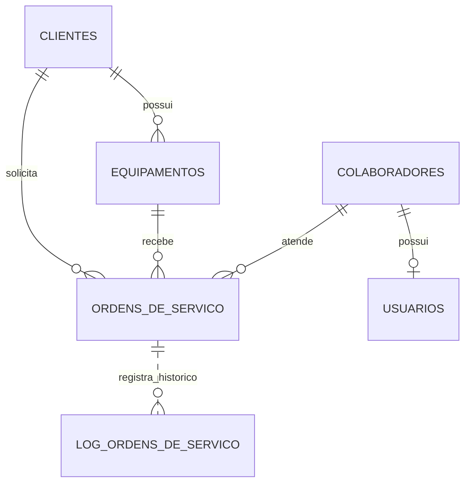
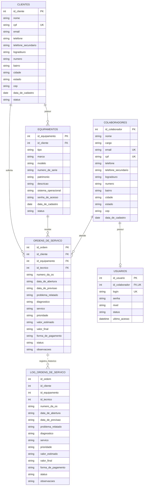

# Modelo Conceitual

```mermaid
erDiagram
    CLIENTES ||--o{ EQUIPAMENTOS : possui
    CLIENTES ||--o{ ORDENS_DE_SERVICO : solicita
    EQUIPAMENTOS ||--o{ ORDENS_DE_SERVICO : recebe
    COLABORADORES ||--o{ ORDENS_DE_SERVICO : atende
    COLABORADORES ||--o| USUARIOS : possui
    ORDENS_DE_SERVICO ||..o{ LOG_ORDENS_DE_SERVICO : registra_historico
```

# Modelo lógico

```mermaid
erDiagram
    CLIENTES ||--o{ EQUIPAMENTOS : possui
    CLIENTES ||--o{ ORDENS_DE_SERVICO : solicita
    EQUIPAMENTOS ||--o{ ORDENS_DE_SERVICO : recebe
    COLABORADORES ||--o{ ORDENS_DE_SERVICO : atende
    COLABORADORES ||--o| USUARIOS : possui
    ORDENS_DE_SERVICO ||..o{ LOG_ORDENS_DE_SERVICO : registra_historico

    CLIENTES {
        int id_cliente PK
        string nome
        string cpf UK
        string email
        string telefone
        string telefone_secundario
        string logradouro
        string numero
        string bairro
        string cidade
        string estado
        string cep
        date data_de_cadastro
        string status
    }

    EQUIPAMENTOS {
        int id_equipamento PK
        int id_cliente FK
        string tipo
        string marca
        string modelo
        string numero_de_serie
        string patrimonio
        string descricao
        string sistema_operacional
        string senha_de_acesso
        date data_de_cadastro
        string status
    }

    COLABORADORES {
        int id_colaborador PK
        string nome
        string cargo
        string email UK
        string cpf UK
        string telefone
        string telefone_secundario
        string logradouro
        string numero
        string bairro
        string cidade
        string estado
        string cep
        date data_de_cadastro
    }

    USUARIOS {
        int id_usuario PK
        int id_colaborador FK, UK
        string login UK
        string senha
        string nivel
        string status
        datetime ultimo_acesso
    }

    ORDENS_DE_SERVICO {
        int id_ordem PK
        int id_cliente FK
        int id_equipamento FK
        int id_tecnico FK
        string numero_da_os
        string data_de_abertura
        string data_de_previsao
        string problema_relatado
        string diagnostico
        string servico
        string prioridade
        string valor_estimado
        string valor_final
        string forma_de_pagamento
        string status
        string observacoes
    }

    LOG_ORDENS_DE_SERVICO {
        int id_ordem
        int id_cliente
        int id_equipamento
        int id_tecnico
        string numero_da_os
        string data_de_abertura
        string data_de_previsao
        string problema_relatado
        string diagnostico
        string servico
        string prioridade
        string valor_estimado
        string valor_final
        string forma_de_pagamento
        string status
        string observacoes
    }
```