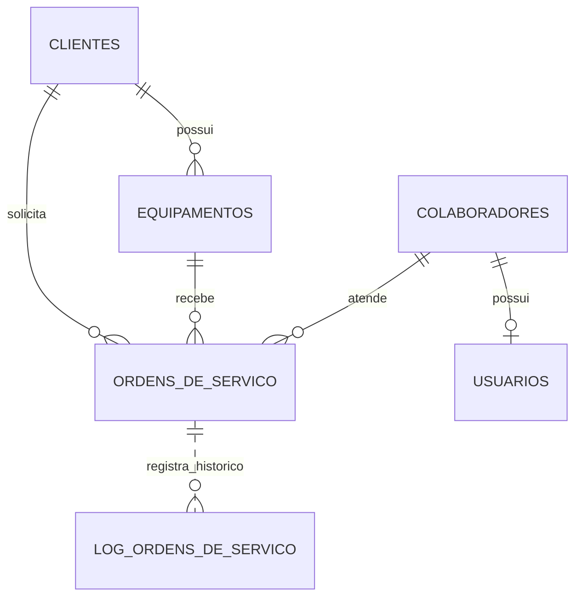
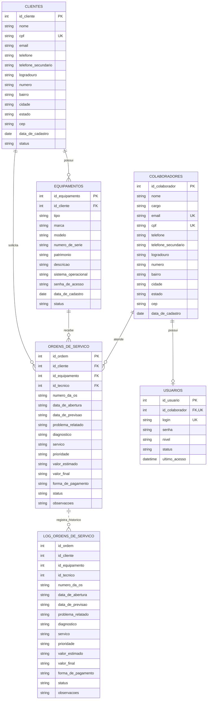

## Modelagem do Banco de Dados

A modelagem foi organizada em duas partes: a modelagem conceitual, que apresenta as entidades e seus relacionamentos, e a modelagem lógica, que detalha os atributos e as chaves previstas para cada tabela.

### Entidades

- **Clientes:** pessoas que solicitam atendimento.
- **Equipamentos:** aparelhos pertencentes aos clientes e recebidos para manutenção.
- **Colaboradores:** pessoas que trabalham na empresa, incluindo técnicos e outros funcionários.
- **Usuários:** contas usadas pelos colaboradores para acessar o sistema.
- **Ordens de serviço:** registros dos atendimentos e do trabalho realizado nos equipamentos.
- **Log de ordens de serviço:** registros históricos relacionados às ordens de serviço.

### Relacionamentos e regras definidos

- Um cliente pode possuir vários equipamentos; cada equipamento está vinculado a um cliente.
- Um cliente pode solicitar várias ordens de serviço; cada ordem está vinculada a um cliente e a um equipamento.
- Um equipamento pode aparecer em várias ordens de serviço ao longo do tempo.
- Um colaborador pode ser responsável por várias ordens de serviço. A ordem registra o técnico responsável por meio de `id_tecnico`.
- Um colaborador pode ter no máximo um usuário, e cada usuário pertence a um colaborador.
- Os usuários controlam o acesso à aplicação. O campo `nivel` representa o tipo de acesso: `administrador`, `atendente` ou `tecnico`.
- O administrador pode acessar todas as áreas e gerenciar cadastros e usuários. O atendente pode cadastrar clientes, equipamentos e ordens e consultar os atendimentos. O técnico pode consultar as ordens atribuídas a ele e atualizar o andamento e os dados técnicos do serviço.
- O log guarda uma cópia dos dados da ordem para histórico. Conforme definido nesta modelagem, ele não possui chave estrangeira para a tabela de ordens; a associação pelo identificador é apenas informativa.

### Modelo conceitual



A linha tracejada entre ordens e log representa uma associação conceitual. O log não terá chave estrangeira para a ordem.

---

### Modelo lógico



---

### Modelo físico

```sql
    CREATE DATABASE web_system_assistencia_tecnica;

    USE web_system_assistencia_tecnica;

    CREATE TABLE clientes (
        id_cliente INT AUTO_INCREMENT,
        nome VARCHAR(100) NOT NULL,
        cpf VARCHAR(11) NOT NULL UNIQUE,
        email VARCHAR(150) NOT NULL UNIQUE,
        telefone VARCHAR(16) NOT NULL UNIQUE,
        logradouro VARCHAR(100) NOT NULL,
        numero VARCHAR(10) NOT NULL,
        bairro VARCHAR(100) NOT NULL,
        cidade VARCHAR(100) NOT NULL,
        estado VARCHAR(100) NOT NULL,
        cep VARCHAR(8) NOT NULL,
        data_de_cadastro DATE DEFAULT (CURRENT_DATE),
        status ENUM('ativo', 'inativo') DEFAULT 'ativo',

        PRIMARY KEY (id_cliente)
    );

    CREATE TABLE equipamentos (
        id_equipamento INT AUTO_INCREMENT,
        id_cliente INT NOT NULL,
        tipo VARCHAR(100) NOT NULL,
        marca VARCHAR(100) NOT NULL,
        numero_de_serie VARCHAR(100) NOT NULL,
        patrimonio VARCHAR(100) NOT NULL,
        descricao VARCHAR(100) NOT NULL,
        sistema_operacional VARCHAR(100) NOT NULL,
        senha_de_acesso VARCHAR(100) NOT NULL,
        data_de_cadastro DATE DEFAULT (CURRENT_DATE),
        status ENUM('ativo', 'inativo') NOT NULL DEFAULT 'ativo',

        PRIMARY KEY (id_equipamento),
        UNIQUE (id_equipamento, id_cliente),
        FOREIGN KEY (id_cliente) REFERENCES clientes(id_cliente)
    );

    CREATE TABLE colaboradores (
        id_colaborador INT AUTO_INCREMENT,
        nome VARCHAR(100) NOT NULL,
        cargo VARCHAR(100) NOT NULL,
        cpf VARCHAR(11) NOT NULL UNIQUE,
        email VARCHAR(150) NOT NULL UNIQUE,
        telefone VARCHAR(16) NOT NULL UNIQUE,
        logradouro VARCHAR(100) NOT NULL,
        numero VARCHAR(10) NOT NULL,
        bairro VARCHAR(100) NOT NULL,
        cidade VARCHAR(100) NOT NULL,
        estado VARCHAR(100) NOT NULL,
        cep VARCHAR(8) NOT NULL,
        data_de_cadastro DATE DEFAULT (CURRENT_DATE),

        PRIMARY KEY (id_colaborador),
        UNIQUE (id_colaborador, email)
    );

    CREATE TABLE usuarios (
        id_usuario INT AUTO_INCREMENT,
        id_colaborador INT NOT NULL UNIQUE,
        login VARCHAR(150) NOT NULL,
        senha TEXT NOT NULL,
        nivel ENUM('administrador', 'atendente', 'tecnico') NOT NULL,
        status ENUM('ativo', 'inativo') DEFAULT 'ativo',

        PRIMARY KEY (id_usuario),
        UNIQUE (login),
        FOREIGN KEY (id_colaborador, login)
            REFERENCES colaboradores(id_colaborador, email)
    );

    CREATE TABLE ordens_de_servico (
        id_ordem INT AUTO_INCREMENT,
        id_cliente INT NOT NULL,
        id_equipamento INT NOT NULL,
        id_tecnico INT NOT NULL,
        numero_da_os VARCHAR(20) NOT NULL,
        data_de_abertura DATETIME DEFAULT CURRENT_TIMESTAMP,
        data_de_previsao DATETIME,
        problema_relatado TEXT NOT NULL,
        diagnostico TEXT,
        servico TEXT,
        prioridade ENUM('baixa', 'media', 'alta', 'urgente') DEFAULT 'media',
        valor_estimado DECIMAL(10, 2),
        valor_final DECIMAL(10, 2),
        forma_de_pagamento VARCHAR(50),
        status ENUM(
            'aberta',
            'em_andamento',
            'aguardando_peca',
            'concluida',
            'cancelada'
        ) DEFAULT 'aberta',
        observacoes TEXT,

        PRIMARY KEY (id_ordem),
        UNIQUE (numero_da_os),
        FOREIGN KEY (id_cliente) REFERENCES clientes(id_cliente),
        FOREIGN KEY (id_equipamento, id_cliente)
            REFERENCES equipamentos(id_equipamento, id_cliente),
        FOREIGN KEY (id_tecnico) REFERENCES colaboradores(id_colaborador)
    );

    CREATE TABLE log_ordens_de_servico (
        id_log INT AUTO_INCREMENT,
        id_ordem INT NOT NULL,
        id_cliente INT NOT NULL,
        id_equipamento INT NOT NULL,
        id_tecnico INT NOT NULL,
        numero_da_os VARCHAR(20) NOT NULL,
        data_de_abertura DATETIME,
        data_de_previsao DATETIME,
        problema_relatado TEXT,
        diagnostico TEXT,
        servico TEXT,
        prioridade VARCHAR(20),
        valor_estimado DECIMAL(10, 2),
        valor_final DECIMAL(10, 2),
        forma_de_pagamento VARCHAR(50),
        status VARCHAR(30),
        observacoes TEXT,
        data_do_registro DATETIME DEFAULT CURRENT_TIMESTAMP,

        PRIMARY KEY (id_log)
    );

    DELIMITER //

    CREATE TRIGGER registrar_ordens_concluidas
    AFTER UPDATE ON ordens_de_servico
    FOR EACH ROW
    BEGIN
        IF NEW.status = 'concluida'
        AND OLD.status <> 'concluida' THEN

            INSERT INTO log_ordens_de_servico (
                id_ordem,
                id_cliente,
                id_equipamento,
                id_tecnico,
                numero_da_os,
                data_de_abertura,
                data_de_previsao,
                problema_relatado,
                diagnostico,
                servico,
                prioridade,
                valor_estimado,
                valor_final,
                forma_de_pagamento,
                status,
                observacoes
            )
            VALUES (
                NEW.id_ordem,
                NEW.id_cliente,
                NEW.id_equipamento,
                NEW.id_tecnico,
                NEW.numero_da_os,
                NEW.data_de_abertura,
                NEW.data_de_previsao,
                NEW.problema_relatado,
                NEW.diagnostico,
                NEW.servico,
                NEW.prioridade,
                NEW.valor_estimado,
                NEW.valor_final,
                NEW.forma_de_pagamento,
                NEW.status,
                NEW.observacoes
            );
        END IF;
    END//

    DELIMITER ;
```

### Descrição dos campos de acesso

- `login`: identificador usado para entrar no sistema. A proposta atual é gerar um login com o primeiro nome do colaborador e quatro caracteres alfanuméricos aleatórios. O login deve ser único.
- `senha`: credencial da conta do usuário.
- `nivel`: define o grupo de permissões (`administrador`, `atendente` ou `tecnico`).
- `status`: indica se a conta está ativa ou inativa.
- `ultimo_acesso`: data e hora do acesso mais recente.
- `cargo` em `COLABORADORES`: função da pessoa na empresa. É diferente do `nivel`, que controla o que ela pode fazer no sistema.

### Legenda

- `PK`: chave primária.
- `FK`: chave estrangeira.
- `UK`: valor único.