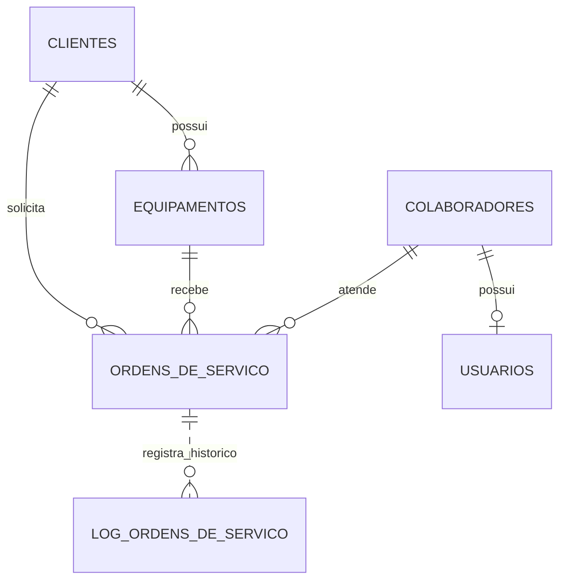
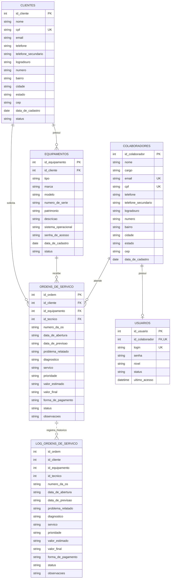

## Modelagem do Banco de Dados

A modelagem foi organizada em duas partes: a modelagem conceitual, que apresenta as entidades e seus relacionamentos, e a modelagem lógica, que detalha os atributos e as chaves previstas para cada tabela.

### Entidades

- **Clientes:** pessoas que solicitam atendimento.
- **Equipamentos:** aparelhos pertencentes aos clientes e recebidos para manutenção.
- **Colaboradores:** pessoas que trabalham na empresa, incluindo técnicos e outros funcionários.
- **Usuários:** contas usadas pelos colaboradores para acessar o sistema.
- **Ordens de serviço:** registros dos atendimentos e do trabalho realizado nos equipamentos.
- **Log de ordens de serviço:** registros históricos relacionados às ordens de serviço.

### Relacionamentos e regras definidos

- Um cliente pode possuir vários equipamentos; cada equipamento está vinculado a um cliente.
- Um cliente pode solicitar várias ordens de serviço; cada ordem está vinculada a um cliente e a um equipamento.
- Um equipamento pode aparecer em várias ordens de serviço ao longo do tempo.
- Um colaborador pode ser responsável por várias ordens de serviço. A ordem registra o técnico responsável por meio de `id_tecnico`.
- Um colaborador pode ter no máximo um usuário, e cada usuário pertence a um colaborador.
- Os usuários controlam o acesso à aplicação. O campo `nivel` representa o tipo de acesso: `administrador`, `atendente` ou `tecnico`.
- O administrador pode acessar todas as áreas e gerenciar cadastros e usuários. O atendente pode cadastrar clientes, equipamentos e ordens e consultar os atendimentos. O técnico pode consultar as ordens atribuídas a ele e atualizar o andamento e os dados técnicos do serviço.
- O log guarda uma cópia dos dados da ordem para histórico. Conforme definido nesta modelagem, ele não possui chave estrangeira para a tabela de ordens; a associação pelo identificador é apenas informativa.

### Diagrama conceitual

A linha tracejada entre ordens e log representa uma associação conceitual. O log não terá chave estrangeira para a ordem.

### Modelo lógico

### Descrição dos campos de acesso

- `login`: identificador usado para entrar no sistema. A proposta atual é gerar um login com o primeiro nome do colaborador e quatro caracteres alfanuméricos aleatórios. O login deve ser único.
- `senha`: credencial da conta do usuário.
- `nivel`: define o grupo de permissões (`administrador`, `atendente` ou `tecnico`).
- `status`: indica se a conta está ativa ou inativa.
- `ultimo_acesso`: data e hora do acesso mais recente.
- `cargo` em `COLABORADORES`: função da pessoa na empresa. É diferente do `nivel`, que controla o que ela pode fazer no sistema.

### Legenda

- `PK`: chave primária.
- `FK`: chave estrangeira.
- `UK`: valor único.

## Stack prevista

- **PHP:** processamento do sistema e comunicação com o banco de dados.
- **MySQL:** armazenamento dos dados.
- **HTML:** estrutura das páginas.
- **CSS:** apresentação visual.
- **JavaScript:** interações no navegador.
